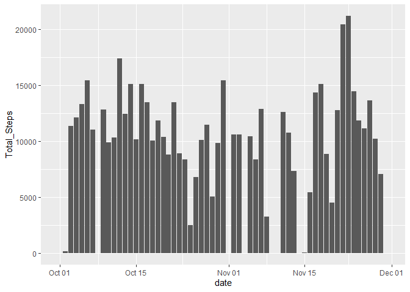
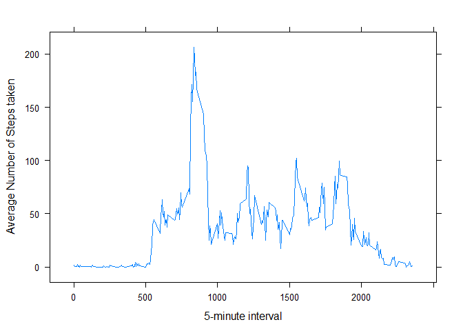
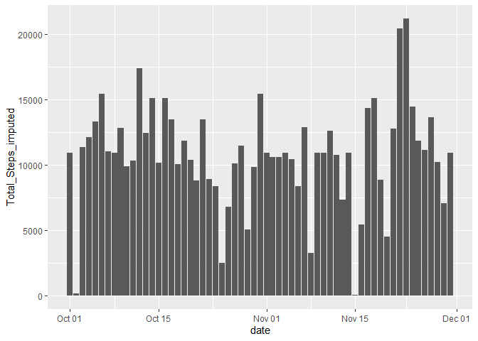
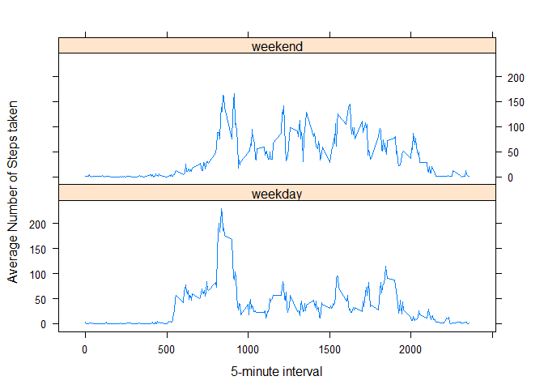

## Loading and preprocessing the data

```r
#Loading the activity data
activity_data <- read.csv("activity.csv")

# Converting the date and interval variables format 
activity_data$date <- as.Date(activity_data$date)
activity_data$interval <- as.factor(activity_data$interval)
```

## What is mean total number of steps taken per day?

```r
library(dplyr)
```

```
## 
## Attaching package: 'dplyr'
```

```
## The following objects are masked from 'package:stats':
## 
##     filter, lag
```

```
## The following objects are masked from 'package:base':
## 
##     intersect, setdiff, setequal, union
```

```r
total_daily_steps <- activity_data %>% 
                     group_by(date) %>% 
                     summarise(Total_Steps =sum(steps, na.rm = TRUE))
```

```
## `summarise()` ungrouping output (override with `.groups` argument)
```

```r
library(ggplot2)
ggplot(total_daily_steps, aes(x = date, y = Total_Steps)) + 
           geom_histogram(stat = "identity")
```

```
## Warning: Ignoring unknown parameters: binwidth, bins, pad
```

<!-- -->

```r
mean_Total_Steps <- mean(total_daily_steps$Total_Steps, na.rm = TRUE)
median_Total_Steps <- median(total_daily_steps$Total_Steps, na.rm = TRUE)
print(paste("Mean of the Total Steps taken per day", round(mean_Total_Steps,2)), quote = FALSE)
```

```
## [1] Mean of the Total Steps taken per day 9354.23
```

```r
print(paste("Median of the Total Steps taken per day",round(median_Total_Steps,2)), quote = FALSE)
```

```
## [1] Median of the Total Steps taken per day 10395
```

## What is the average daily activity pattern?

```r
Average_interval_steps <- activity_data %>% 
                     group_by(interval) %>% 
                     summarise(Average_Steps =mean(steps, na.rm = TRUE))
```

```
## `summarise()` ungrouping output (override with `.groups` argument)
```

```r
Average_interval_steps$interval <- as.numeric(as.character(Average_interval_steps$interval))

library(lattice)
xyplot(Average_Steps ~ interval, data = Average_interval_steps, type = "l", xlab = "5-minute interval", ylab = "Average Number of Steps taken" )
```

<!-- -->

```r
# Average_interval_steps$interval <- as.character(Average_interval_steps$interval)
max_interval <- Average_interval_steps$interval[Average_interval_steps$Average_Steps==max(Average_interval_steps$Average_Steps, na.rm = TRUE)]
print(paste0("The ",max_interval,"th 5-minute interval has the maximum number of steps on an average across all the days"), quote = FALSE)
```

```
## [1] The 835th 5-minute interval has the maximum number of steps on an average across all the days
```

## Imputing missing values

```r
print(paste0("The total number of rows with NAs is ",sum(!complete.cases(activity_data))), quote = FALSE)
```

```
## [1] The total number of rows with NAs is 2304
```

```r
print("The columns with NAs are highlighted below", quote = FALSE)
```

```
## [1] The columns with NAs are highlighted below
```

```r
print(colSums(is.na(activity_data)))
```

```
##    steps     date interval 
##     2304        0        0
```

```r
#As we have NAs only in the steps column, we impute only the NAs in steps column
# We use the ceiling of mean of steps by interval for imputation
# Taking a copy of the original dataset
activity_data_impute <- activity_data

activity_data_impute$steps <- ave(activity_data_impute$steps, activity_data_impute$interval, FUN = function(x) ifelse(is.na(x), ceiling(mean(x, na.rm = TRUE)), x))

print("Column wise check for number of NAs", quote = FALSE)
```

```
## [1] Column wise check for number of NAs
```

```r
print(colSums(is.na(activity_data_impute)))
```

```
##    steps     date interval 
##        0        0        0
```

```r
total_daily_steps_impute <- activity_data_impute %>% 
                     group_by(date) %>% 
                     summarise(Total_Steps_imputed =sum(steps, na.rm = TRUE))
```

```
## `summarise()` ungrouping output (override with `.groups` argument)
```

```r
ggplot(total_daily_steps_impute, aes(x = date, y = Total_Steps_imputed)) + 
           geom_histogram(stat = "identity")
```

```
## Warning: Ignoring unknown parameters: binwidth, bins, pad
```

<!-- -->

```r
mean_Total_Steps_impute <- mean(total_daily_steps_impute$Total_Steps_imputed)
median_Total_Steps_impute <- median(total_daily_steps_impute$Total_Steps_imputed)
print(paste("Imputed Mean of the Total Steps taken per day", round(mean_Total_Steps_impute,2)), quote = FALSE)
```

```
## [1] Imputed Mean of the Total Steps taken per day 10784.92
```

```r
print(paste("Imputed Median of the Total Steps taken per day",median_Total_Steps_impute), quote = FALSE)
```

```
## [1] Imputed Median of the Total Steps taken per day 10909
```

```r
print(paste0("Mean of Total Steps before Imputation was ",round(mean_Total_Steps,2)," and  Mean of Total Steps after Imputation is ",round(mean_Total_Steps_impute,2)," . The Mean of total Steps per day has increased by ",round(mean_Total_Steps_impute - mean_Total_Steps,2), " after Imputation"), quote = FALSE)
```

```
## [1] Mean of Total Steps before Imputation was 9354.23 and  Mean of Total Steps after Imputation is 10784.92 . The Mean of total Steps per day has increased by 1430.69 after Imputation
```

```r
print(paste0("Median of Total Steps before Imputation was ",median_Total_Steps," and  Median of Total Steps after Imputation is ",median_Total_Steps_impute," . The Median of total Steps per day has increased by ",median_Total_Steps_impute - median_Total_Steps, " after Imputation"), quote = FALSE)
```

```
## [1] Median of Total Steps before Imputation was 10395 and  Median of Total Steps after Imputation is 10909 . The Median of total Steps per day has increased by 514 after Imputation
```
## Are there differences in activity patterns between weekdays and weekends?

```r
activity_data_impute$weekdays_end <- factor(ifelse(weekdays(activity_data_impute$date) %in% c("Saturday", "Sunday"), "weekend", "weekday"))

Average_interval_steps_interval_weekdays <- activity_data_impute %>% 
                     group_by(weekdays_end,interval) %>% 
                     summarise(Average_Steps =mean(steps))
```

```
## `summarise()` regrouping output by 'weekdays_end' (override with `.groups` argument)
```

```r
Average_interval_steps_interval_weekdays$interval <- as.numeric(as.character(Average_interval_steps_interval_weekdays$interval))

library(lattice)
xyplot(Average_Steps ~ interval | weekdays_end, data = Average_interval_steps_interval_weekdays, type = "l", layout = c(1,2), xlab = "5-minute interval", ylab = "Average Number of Steps taken" )
```

<!-- -->
